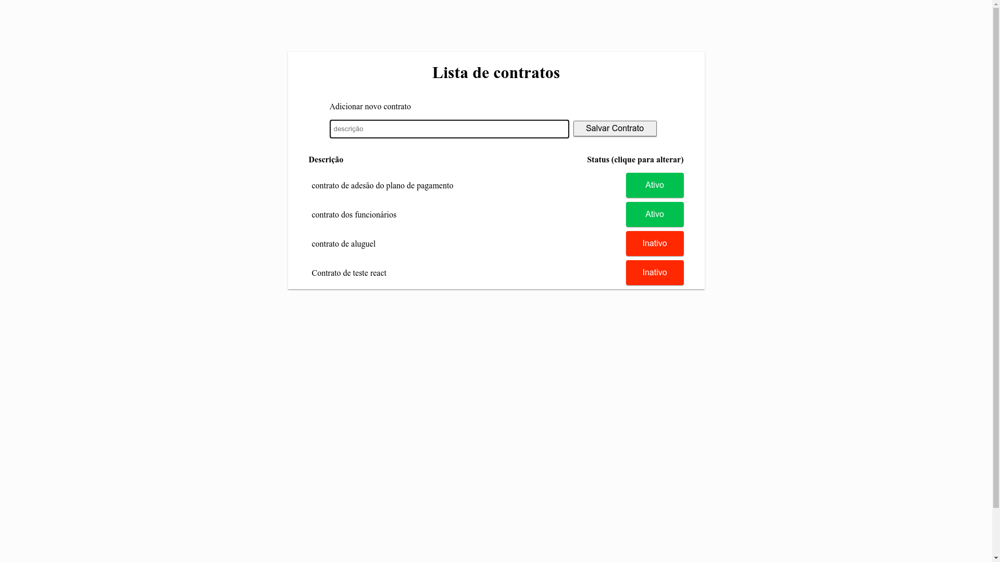

# Teste para Webropay

- Foi criado um protótipo de api com o swagger-editor seguindo as especificações da openApi 3.0 e gerado um node-server

- Foi implementado a conexão com o banco de dados e as funcionalidades de listar os contratos, criar um contrato e editar o status de um contrato

- Foi criado uma página simples no React que consome as funcionalidades da Api criada

- Foi utilizado o mínimo de código

## Para a execução local

Entrar dentro da basta 'backend' e criar um arquivo .env com as especificações a seguir, subtstituindo as informações pelas da conexão como banco.

```sh
    DB_USER=usuário_do_banco
    DB_HOST=host_do_banco
    DB_DATABASE=database_do_banco
    DB_PASSWORD=senha_do_usuário
    DB_PORT=porta_de_conexão
```

Após criar o arquivo .env, executar o comando:

```sh
    npm start
```

Para visualizar a interface so Swagger, navegue para :

```sh
    http://localhost:8080/docs
```

Com o backend em execução, abrir outro terminal e navegar até a pasta 'frontend' e executar o comando:

```sh
    npm install
```

Aguardar a instalação das dependências e executar o comando:

```sh
    npm start
```

## Resultado

### Celular

<h1 align="center">
    
</h1>

### Desktop

<h1 align="center">
    
</h1>
